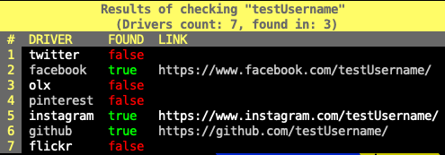

# sochecker
Check websites for specific username. It allows you to quickly query bunch of websites for specific username.

Currently, it supports:
* Facebook
* Instagram
* Twitter
* Github
* Pinterest
* Flick
* OLX.ba local

# Installation
```bash
$ go get github.com/lateralusd/sochecker
```

# Usage
You simply need to pass the username you would like to check.

Running the `sochecker testUsername` will provide create the following table.



## Instagram Note
For the instagram, you need to create `.cookies` file containing the instagram cookies for your account.

You can obtain them by logging on the instagram, inspecting elements and clicking on the storage tab(Safari).

The following cookies are needed:
* ds_user_id
* sessionid
* csrftoken

After you collected the cookies, fill the .cookies file like in the example below.

```yaml
ds_user_id: yourID
sessionid: sessionIDValue
csrftoken: csrfToken
```

If you do not have .cookies file present and populated, instagram driver will return false whether user exists or does not exists.

# Contributing/Extending

All it takes to write a new plugin is to create another directory under `plugins/`, create a `.igo` file.

For example, if you are writing for the amazon.

```bash
$ cd plugins/
$ mkdir amazon && cd amazon
$ vim amazon.igo
```

Your new type needs to implement the `Check` interface methods which are:

```golang
type Check interface {
  Check(name string) bool
  Link() string
}
```

* Check(name string) bool - for the username in `name` parameter, will return true if the user exists, or false if the user does not exist
* Link() string - returns the link to the user page on the plugin

After you implemented the following methods, you need to call `Register` function which accepts the name of the driver and the type that implements `Check` interface.

```golang

import "github.com/lateralusd/sochecker/checker"

type AmazonCheck struct{}

func (ac *AmazonCheck) Check(name string) bool {
  // do the logic here
  return false
}

func (ac *AmazonCheck) Link() string {
  return "https://www.linktotheuseratamazon"
}

func init() {
  checker.Register("amazon", &AmazonCheck{})
}
```
